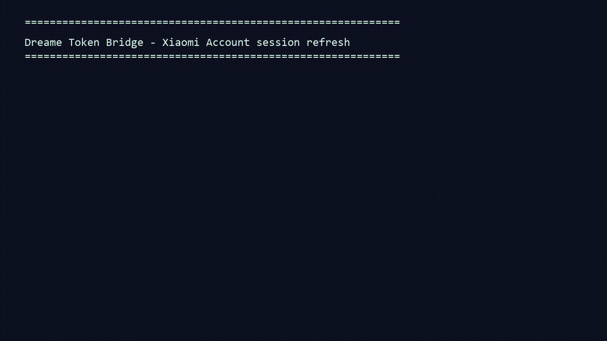

# Synthetic terminal demo



This animation is generated from fictional terminal events by
[`scripts/generate_terminal_demo.ps1`](../scripts/generate_terminal_demo.ps1). It
is **not** a screen recording. It animates interactive username, password, CAPTCHA,
2FA, and redacted-token stages. The e-mail address, IDs, cache path, CAPTCHA, and
2FA code are examples only and cannot authenticate any account.

To recreate it after editing the text, run the following from the repository root
on Windows with FFmpeg installed:

```powershell
.\scripts\generate_terminal_demo.ps1
```
